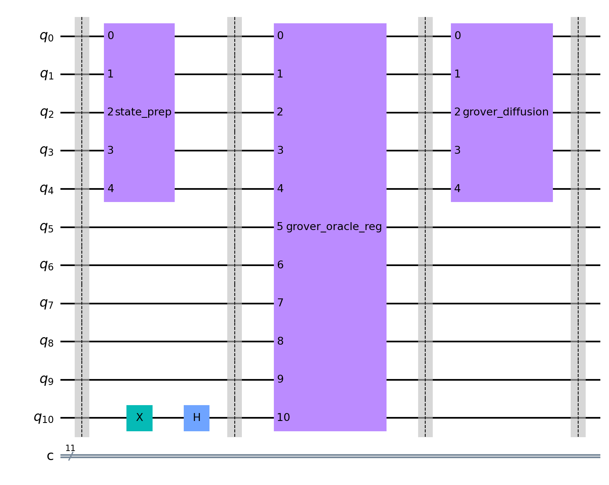

# VCGC: Vertex Coloring with Grover's Circuit 

[](https://choosealicense.com/licenses/mit/)
[](https://www.python.org/downloads/)
[](https://qiskit.org/)

## Welcome to the Quantum Graph Coloring Universe! 🌌

VCGC is a collection of experiments to run Grover's search algorithm for graph vertex coloring problems using quantum circuits. We're exploring the quantum advantage for NP-hard problems - one qubit at a time!



## 🚀 Features

- **Quantum-Powered Graph Coloring**: Solve classic vertex coloring problems using Grover's algorithm
- **Real Quantum Hardware**: Run your circuits on actual IBM Quantum computers
- **Quantum Bias Analysis**: Check if quantum hardware shows bias toward certain states
- **Error Mitigation**: Implement dynamic decoupling and M3 mitigation techniques
- **Visualization Tools**: Pretty plots of your quantum circuit results
- **Customizable Graphs**: Try different graph structures and coloring constraints

## 🔧 Installation

```bash
# Clone the repository
git clone https://github.com/yourusername/vcgc.git
cd vcgc

# Set up virtual environment
python -m venv .venv
source .venv/bin/activate  # On Windows: .venv\Scripts\activate

# Install dependencies
pip install -r requirements.txt
```

## 📚 Getting Started

1. **Set up your IBM Quantum account**:
   - Create an IBM Quantum account at [quantum-computing.ibm.com](https://quantum-computing.ibm.com/)
   - Get your API token and set it up in ibm_quantum_platform.ipynb

2. **Run your first quantum coloring circuit**:
   - Open graph_2_grover_circuit.ipynb for a basic 2-node graph example
   - Follow the notebook cells to understand the implementation

3. **Experiment with different graphs**:
   - Check out the graphs directory for other graph examples
   - Create your own graph structure and implement its oracle

## 🧪 Experiments

### Basic Circuit Implementation

```python
# Create a quantum subcircuit for grover oracle
grover_oracle = QuantumCircuit(5, name="grover_oracle")
grover_oracle.x(0)
grover_oracle.ccx(0,1,3)
grover_oracle.x(0)
grover_oracle.cx(0,2)
grover_oracle.ccx(2,3,4)
grover_oracle.cx(0,2)
grover_oracle.x(0)
```

### Run on Real Quantum Hardware

```python
service = QiskitRuntimeService()
backend = service.least_busy(simulator=False, operational=True)
sampler = Sampler(mode=backend)
sampler.options.default_shots = 10_000
job = sampler.run([transpiled_circuit])
```

## 🔬 Quantum Bias Analysis

We've included experiments to check if there's any bias in quantum hardware towards states with more 1s vs 0s. You can run these experiments yourself:

1. Open ibm_quantum_bias_check.ipynb
2. Follow the implementation of both regular and "inverted" circuits
3. Compare results to see if there's a bias in real quantum hardware

## 📊 Results Visualization

```python
from qiskit.visualization import plot_distribution
result = job.result()
raw_counts = result[0].data.c.get_counts()
new_counts = process_counts(raw_counts)
plot_distribution(new_counts)
```

## 📋 Requirements

- Python 3.10
- Qiskit 
- Qiskit Aer 
- Matplotlib 
- NumPy 
- mthree
- qiskit-ibm-runtime

## 🤝 Contributing

Contributions welcome! Feel free to:
- Report bugs
- Suggest improvements
- Submit pull requests
- Add examples for new graph structures

## 🔮 Future Work

- Implement larger graph structures
- Explore quantum error correction techniques
- Compare with classical algorithms
- Add support for other quantum platforms
- Optimize circuit depth for better results on noisy hardware

## 👏 Acknowledgements

- IBM Quantum team for providing quantum computing resources
- Qiskit community for their excellent documentation and support
- Graph theory researchers who made this field so fascinating!

---

*"The most incomprehensible thing about quantum mechanics is that it is comprehensible."* - Adapted from Albert Einstein

Happy quantum computing! 🧬💻🔮